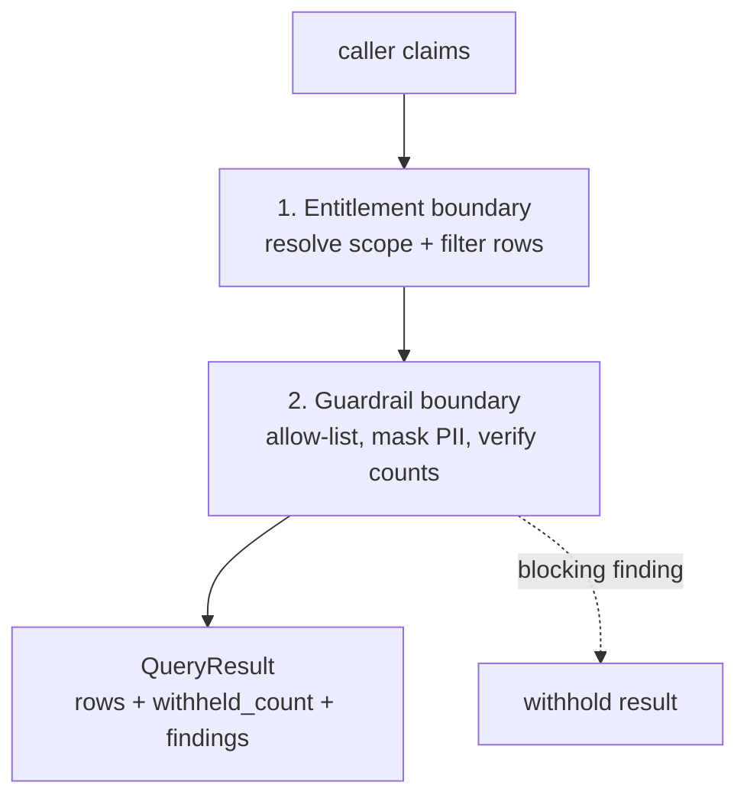

# governed-mcp

A **governed, read-only MCP server** — typed tools, per-caller row-level security,
and deterministic guardrails, with an eval harness that proves leakage can't
happen.

Give an AI agent a *window* onto data instead of a door. The agent can ask
questions and read a published field surface, but it can't write, can't reach
unpublished fields, and can't see rows it isn't entitled to — and when data *is*
hidden from it, the result says so instead of silently omitting it.

[](LICENSE)
[](pyproject.toml)

---

## The problem

The moment you point an LLM agent at a data store, three risks show up together:

1. **Over-exposure** — the agent (or its prompt) can reach more than it should.
2. **Silent filtering** — security layers hide rows, and the agent can't tell
   "there is no data" from "you're not allowed to see it," so it fabricates.
3. **Leakage** — a masked or restricted field slips through to the model's
   context, and from there into a user's screen.

This server is a worked answer to all three.

## What it does

- **Read-only by construction.** Three tools — `query_customers`,
  `query_accounts`, `aggregate_balances` — plus `describe_schema`. No write
  surface exists to call.
- **Per-caller row-level security.** Every request carries caller claims
  (`admin`, `rm` + `rm_id`, `regional_director` + `region`). Rows are filtered
  before they reach the response. Unknown claims fail **closed** — zero rows.
- **Honest disclosure.** Every result carries a `withheld_count`, so the agent
  can tell "empty" from "hidden."
- **Deterministic guardrails.** A second, independent layer publishes only
  allow-listed fields, masks account numbers to `****-NNNN`, and verifies
  `visible + withheld == total`. A blocking finding withholds the whole result.
- **Provable.** A ten-case adversarial eval (`leakage`, `fabrication`,
  `disclosure`, `grounding`) runs in CI and fails the build if any boundary
  slips.

## Architecture

Two independent boundaries, failing differently:



See [docs/architecture.md](docs/architecture.md) for the full rationale.

## Quickstart

Requires Python 3.11+ and [`uv`](https://docs.astral.sh/uv/).

```bash
git clone https://github.com/emory-usc/governed-mcp.git
cd governed-mcp

uv sync --extra mcp          # install (core + MCP SDK)

uv run governed verify       # live demo of RLS + guardrails
uv run governed eval         # adversarial eval harness (10 cases)
uv run pytest                # unit tests

uv run governed run          # start the MCP server (streamable HTTP :8000)
```

No API key and no Azure required for any of the above.

## Sample output

`governed verify` walks the boundaries with four caller identities:

```
1. Admin — sees the whole book
   customers (all): 36 visible / 0 withheld of 36 matched (v2026.10.1)
   accounts (all):  72 visible / 0 withheld of 72 matched (v2026.10.1)

2. Relationship manager rm-01 — only their customers
   customers (rm-01): 6 visible / 30 withheld of 36 matched
   rm-01 regions visible: ['north']

3. Regional director (north) — only the north region
   customers (north): 6 visible / 30 withheld of 36 matched

4. Anonymous — fail-closed, sees nothing
   customers (anonymous): 0 visible / 36 withheld of 36 matched

5. Account masking
   sample account: {..., 'account_number': '****-0001'}

6. Aggregate (admin, by region)
   Region     Balance     Accounts
   south      $800,000          12
   west       $644,000          12
   ...
```

The eval harness (`governed eval`) reports 10/10 across four families.

## The two boundaries

| Boundary | Where | What it enforces |
|----------|-------|------------------|
| **Entitlement** | `entitlements.py` | claims → scope; row filtering; fail-closed; withheld count |
| **Guardrail** | `guardrails.py` | allow-listed fields; account masking; count integrity; blocking findings |

Neither is the other's backup — they're independent and fail differently, so a
bug in one doesn't silently bypass the other.

## Project structure

```
src/governed_mcp/
├── models.py         # CallerClaims, QueryResult, Finding (Pydantic)
├── data.py           # deterministic synthetic dataset (36 customers, ~72 accounts)
├── entitlements.py   # claims -> scope -> row filtering (boundary 1)
├── guardrails.py     # allow-list, masking, count integrity (boundary 2)
├── core.py           # compose: filter + RLS + guardrails (pure, no LLM)
├── server.py         # MCPServer — typed, read-only tools
├── cli.py            # run / verify / eval / schema / version
└── evals/            # adversarial eval harness (10 cases, 4 families)
infra/main.bicep      # Container Apps, scale-to-zero, App Insights
Dockerfile            # multi-stage, non-root, TCP healthcheck
docs/architecture.md  # full design rationale
SECURITY.md           # security posture
```

## Deployment

`infra/main.bicep` deploys a stateless Container App (streamable HTTP on 8000,
scale-to-zero, TCP liveness probe) with Application Insights. The server holds
no state and no secrets — caller identity is supplied per request. Production
hardening (token-mode auth with a JWT, VNet ingress, a gateway in front) is
documented in `docs/architecture.md`.

## Using from LangChain / LangGraph

The server speaks standard MCP, so any MCP-capable client can consume it.
LangChain exposes it through `langchain-mcp-adapters`:

```python
from langchain_mcp_adapters.client import MultiServerMCPClient

client = MultiServerMCPClient({
    "governed-mcp": {
        "url": "http://localhost:8000/mcp",
        "transport": "streamable_http",
    }
})
tools = await client.get_tools()
# query_customers / query_accounts / aggregate_balances / describe_schema
# are now typed LangChain tools, each bound by the caller's entitlements.
```

## Design notes

- **No LLM in the tool path.** Tools are pure functions over a synthetic
  dataset, so fabrication is structurally impossible — and verified anyway.
- **Fail-closed everywhere.** Unknown claims → zero rows. A count mismatch or a
  leaked field → whole result withheld.
- **The honesty disclosure is the differentiator.** `withheld_count` turns "I
  don't see that" into a first-class part of the contract, which is what lets a
  well-behaved agent stop inventing data.
- **Synthetic data only.** The dataset is generated from constants; nothing real
  is in the repo.

## Disclaimer

Educational demonstration. The bundled dataset is synthetic; nothing here is
real customer data or financial advice.
